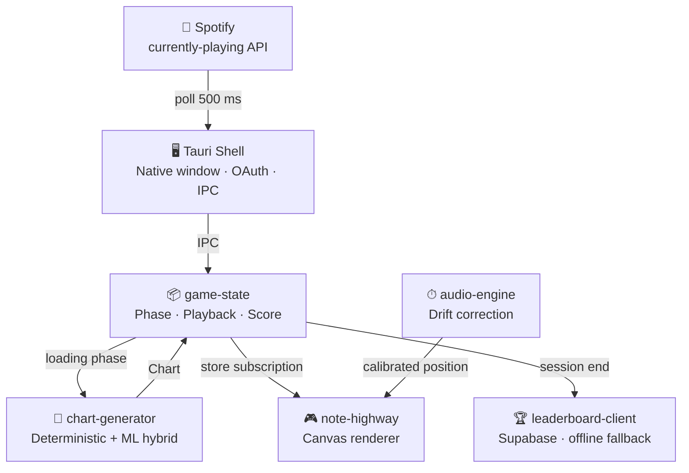
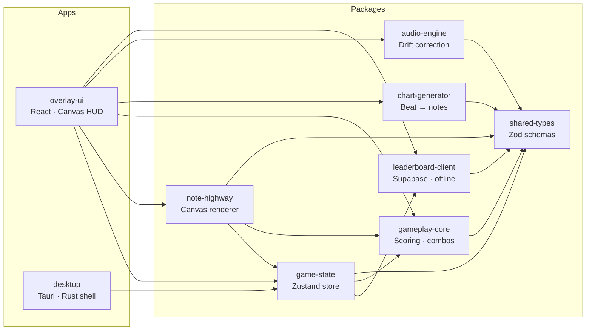
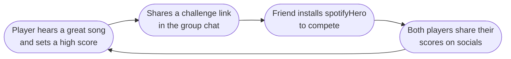

# spotifyHero — Every Song You've Ever Loved Is Now a Playable Level.

> *Open Spotify. Play anything. A note highway appears. Hit the beats. Challenge your friends.*

---

## The Opportunity

Music and gaming are the two biggest entertainment categories on the planet — and they've never truly merged at the desktop layer. Guitar Hero peaked and walked away. Rhythm games moved to mobile, lost precision, and got buried in subscription fees. Meanwhile, **600 million Spotify users** sit at their desks every day with music already playing and nothing to do with their hands.

Nobody has built the thing that lives *right there* — a tiny floating window that turns your actual Spotify queue into a live, playable game. Until now.

---

## What Is spotifyHero?

It's a **desktop overlay** — 180×420 pixels of note highway that sits above your browser, your code editor, your anything — and turns whatever Spotify track you're listening to into a Guitar Hero–style rhythm game. **In real time. On your actual library. For free.**

- 🎵 **Play any song** — not a curated tracklist, your Spotify
- 🎮 **Hit D F J K** when notes reach the line, or flip on autoplay and just watch
- 🏆 **Score and climb** — leaderboards per track and difficulty
- 🔗 **Send a challenge link** — your friend sees your score and tries to beat it

No subscriptions. No DLC. No separate song packs. If it's on Spotify, it's a level.

---

## Why Now

Three trends are colliding at exactly this moment:

1. **Spotify is dominant** — 600M+ users, deeply embedded into every desktop workflow
2. **Rhythm games are having a renaissance** — Fortnite Festival, Hi-Fi Rush, Guitar Hero nostalgia waves; the genre is alive and growing
3. **Overlay apps are having a moment** — tools like Discord, fps counters, and productivity widgets proved users *want* lightweight software that lives alongside everything else

spotifyHero sits at the intersection of all three. The timing has never been better.

---

## How It Works (Under the Hood)

**Chart generation is instant and offline-first.** A deterministic algorithm converts beat / onset data into note charts in milliseconds. An optional ML refiner (ONNX, planned for v2) improves note quality when it's confident enough — and falls back to the deterministic chart when it isn't. The game *never* fails to start.

---

## System Modularity

The codebase is a **pnpm monorepo** — every concern is its own package with a clean interface. You can swap any piece without touching the others.

This means:
- **game-state** can be imported by a future mobile or web client without pulling in any UI
- **note-highway** can be replaced with a WebGL renderer by swapping one package
- **chart-generator** can be upgraded to full ML without touching scoring or the UI
- **leaderboard-client** has a drop-in offline fallback — zero backend, still a great game

---

## The Growth Flywheel

Every challenge link is a free install. Every Spotify Wrapped season is a built-in marketing moment. The social loop is baked into the core game mechanic.

---

## Business Model

| Stage | Revenue |
|-------|---------|
| **Now** | Free on Itch.io — building audience, collecting feedback |
| **Steam launch** | One-time purchase ($4.99–$9.99) + Steam Achievements, cloud save |
| **Pro tier** | Premium skins, ML chart quality upgrade, high-frequency leaderboards |
| **API / licensing** | Chart generation API for other rhythm-game developers |

**Infrastructure cost per user: ~$0.** Chart generation is local. Leaderboards use Supabase's free tier until revenue justifies dedicated infrastructure. No servers means no burn rate.

---

## Traction & Roadmap

| Phase | Status | What ships |
|-------|--------|-----------|
| 1 – Foundation | ✅ **Done** | Monorepo, Tauri shell, always-on-top overlay window |
| 2 – Gameplay MVP | ✅ **Done** | Note highway, autoplay/manual, scoring, combos |
| 3 – Chart generation v1 | ✅ **Done** | Deterministic beat charting, 4 difficulty presets |
| 4 – Social loop | 🔲 **Next** | Leaderboards live, challenge links, score sharing |
| 5 – ML charts v2 | 🔲 Planned | ONNX model in Rust, per-song nuance |
| 6 – Steam launch | 🔲 Planned | Steam build pipeline, achievements, cloud save |
| 7 – Pro & API | 🔲 Future | Cosmetics store, chart generation API |

Three phases complete. A working, shippable product already exists on Itch.io.

---

## Why Invest

**Zero per-user cost.** The game runs entirely on the player's machine — chart generation, scoring, hit detection. Infrastructure is optional and trivially cheap.

**Massive addressable market.** Every Spotify user is a potential player. No niche genre overlap required — if you listen to music at a computer, this is for you.

**Modular architecture = fast iteration.** Each package has a clean boundary. Adding a new renderer, swapping the ML model, or integrating Steam takes days, not months.

**The social mechanic is the moat.** Challenge links tie the game to the listener's actual music taste. That's deeply personal — and deeply shareable.

**The category is proven, the format is new.** Guitar Hero sold $2B+. Spotify has 600M users. Nobody has connected these dots at the desktop overlay layer. We built the bridge.

---

*Built with Tauri · React · Rust · TypeScript · Supabase*
*Available now at [spotifyhero.itch.io](https://spotifyhero.itch.io)*
